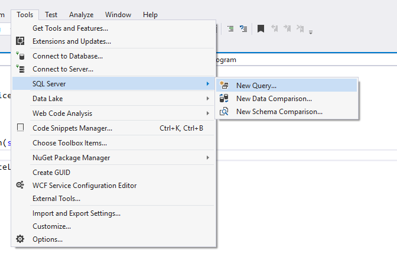
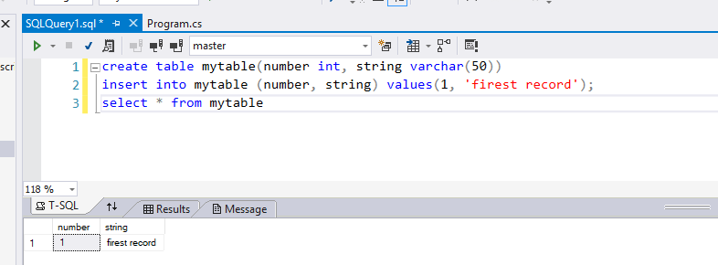

# Ms SQL

Since we are using Visual Studio, we can use integrated database instead of
MySQL and make our life easier. We will able to write queries in Visual Studio
without any 3rd party app.

## Entity Framework Core

Entity Framework (EF) Core is a lightweight, extensible, and cross-platform
version of the popular Entity Framework data access technology. EF Core is an
object-relational mapper (O/RM) that enables .NET developers to work with a
database using .NET objects. It eliminates the need for most of the data-access
code that developers usually need to write. EF Core supports many database
engines, see Database Providers for details.

| Material                         |  Time |
| :------------------------------- | ----: |
| [What is Entity Framework?][1]   | 10:41 |
| [How to add Entity Framework][2] | 13:40 |

[1]: https://www.youtube.com/watch?v=QMzoY48g924&list=PLYMOUCVo86jGwWoSoEkpgnCJ3IPXIQmIC&index=21
[2]: https://www.youtube.com/watch?v=7o5MrOP6LrM&index=22&list=PLYMOUCVo86jGwWoSoEkpgnCJ3IPXIQmIC
