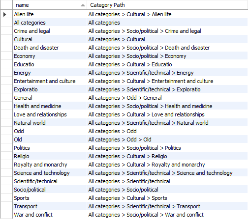

# Hierarchical Structure using SQL

A classical example of such a structure is an employment hierarchy. A company
will have employees. Supervisors will be assigned to lead groups of employees.
Those supervisors, in turn, will report to managers. Low-level managers will
report to higher-level managers. Eventually, you get to the top where you often
find a chief executive officer (CEO). If you sketch it out, the typical company
organization chart will look like an upside down tree, with some branches in the
tree being wider and narrower than others.

## Category hierarchy

First create a new database called `Hierarchical`.
Open the [SQL file](./assets/families.sql), and execute it.
This should generate a table called **categories** which are categories of news
articles on a newspaper website.

Each row in this table contains a column called **parent_category_id**, which
tells you which parent category any category belongs to
(the **All categories** *number 25* has no parent, and so sits at the top
of the hierarchy).

Create a query that shows **the full Category Path** for each category ordered
by the name of the category.

> Hint: You'll need to use 2 self-joins and a string function to solve this
> exercise.
> You'll also need to trap for nulls, for those occasions when a family doesn't
> have
> a parent.
