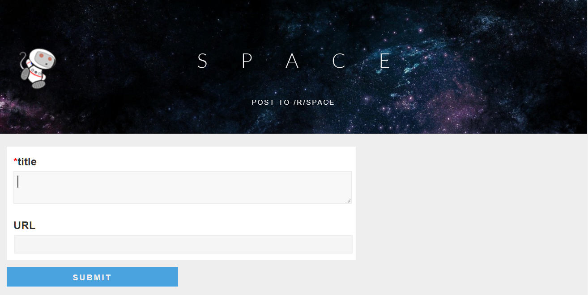
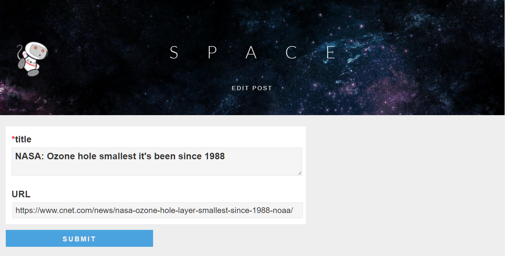

# The Reddit: Frontend

We'll create a simple reddit clone frontend, where the users can create posts,
upvote and downvote existing posts. Your job is to create the HTML, CSS,
JavaScript code to communicate with an existing backend. Later on you can extend
this with more functionality. Use template engine to create and update the dom
elements.

Read the [Reddit Application API documentation](../apispec.md). Store the API's
URL in a global config object because you'll have to change it.

- Feel free to add the header background
  [to your taste](https://www.google.hu/search?tbm=isch&q=space+background)
- The fonts should be
  [light Lato font](https://fonts.google.com/specimen/Lato?selection.family=Lato:300)
  (300 weight)
- The small links under the post links should be replaced with just two links:
  - Modify
  - Remove
- To see exact sizes [peek here](https://www.reddit.com/r/space/)

## Arrow assets

- [arrow images](assets/arrows)

## General notes

- You should create a new HTML file for each view and name them properly
- To navigate to that page, simply use an `anchor` tag.
- Pay close attention to the API docs and what format it needs the data to be
  received.
- Install <https://www.getpostman.com>
- Create a generalized AJAX function that does nothing more than talking to the
  API and calling your callback function

## Backend endpoint

The [backend API](../apispec.md) is implemented for you at this endpoint:

*Basic Version:* <http://secure-reddit.herokuapp.com/simple> (the Whitelabel
Error Page is normal, test with resources)

*Optional features:* <http://secure-reddit.herokuapp.com/>

- Try to see the lists of posts in your browser or Postman

*please note that Heroku serves go to sleep after some inactivity and they take
30sec to "wake up", be patient.*

## Mandatory features

### List the posts

- Create the HTML structure and the design of the main page using placeholder
  data in your markup.
- Remove the static data and fill the page with posts using the API.

#### Notes

- This web service can help you [generate random data](http://mockaroo.com/)
- no other functionality should be added yet
- it's okay to display the elapsed time only in minutes
- if the post has no owner it's posted by anonymous
- numbering does not need to be in order by score

### Add post

- Create the HTML structure and replicate the design
- After successful posting to the backend, redirect the user back to the main
  page

#### Notes

- since you have no user handling yet, display user as anonymous at this point
- **do not let the user post** with empty fields, throw an `alert()` with a
  helpful text
- that link above will show you a modified main page, make sure to check it

### Upvote

Modify the main page so that those arrows can finally do something useful using
the API. The user should be able to upvote or downvote a post.

#### Notes

- the score should be updated after the submission was succesfull
- the color of the arrow should change too

## Optional features

### Modify post

#### Notes

- use query string parameters in the URL for identifying the post
  - `http://localhost/reddit-project/edit.html?id=420`
- fields should be prefilled with the proper data

### Remove post

Modify the main page so it is possible to remove a post using the API.

#### Notes

- anonymous posts can be removed by anyone
- a post with owner can be only removed by the owner
- if you have no rights to remove that post it should remain grey.
- but since it's not mandatory to handle the user you might just enable the
  remove feature for every post

### Login

- Create the HTML structure and the design of the login page.
- Add the functionality.
- Add login link to your navigation bar and modify every request so it uses the
  username.

#### Notes

- no authentication is required
- check out what
  [localStorage](https://developer.mozilla.org/en/docs/Web/API/Window/localStorage)
  is
- if username is set it should display **LOGGED IN AS `<username>`** otherwise
  **LOGIN »**

### Order by score

Modify the main page so the numbering is ordered by the upvotes.
