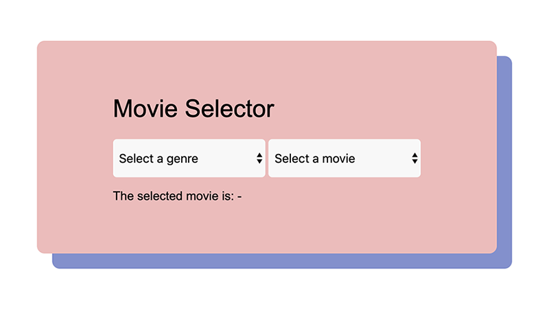

# Movie selector

## Genres

- Sci-fi
- Drama
- Comedy

## Movies

- Moon
- 2001: A Space Odyssey
- Contact
- Darkest Hour
- There Will Be Blood
- American Beauty
- Airplane!
- Deadpool
- Wayne's World

## Assignment

- Add classes to each movie that matches the genre
- Changing the first dropdown should change the contents of the second one
- Display the selected movie

## Style

- Try to create a layout similar to the one pictured above
- The `select` element should have no visible borders (it may look slightly
  different on your screen depending on your browser and OS)
- Try adding a border radius to make your elements round
- Change the default font to a sans-serif one
- The container box should have a colored shadow with a horizontal and vertical
  offset, 20px each
- Once the user has selected a movie, it should appear in the bottom `p` tag
  after the colon in the same color as the box shadow
