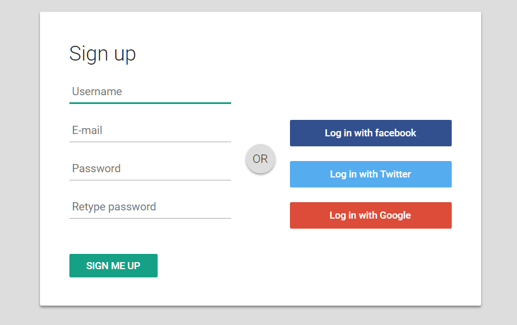

# Sign Up Form

- Create the above layout
- Create input fields for some login information:
  - Username (should be `name`)
  - E-mail (should be `email`)
  - Password (should be `password`)
  - Password again (should be `passwordConfirmation`)
- Create a button for signing in
- Test your form with sending the data to a server:
  `action=https://newsletter-ws.herokuapp.com/register`
