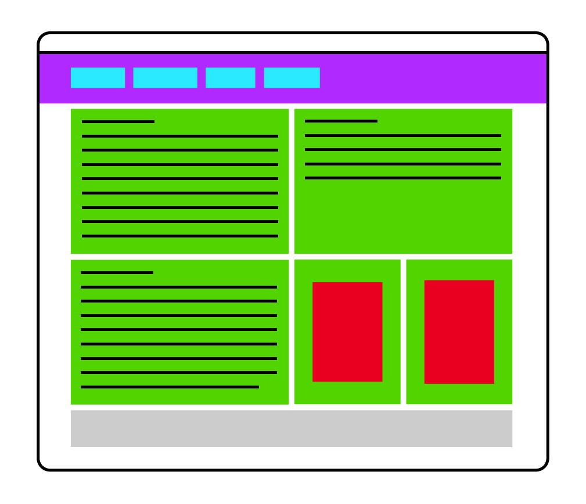

# CSS Grid

Learn about modern CSS layout

## Objectives

- Understand what grids are
- Get to know grid basics

## Materials & Resources

| Material                                                                                          |  Time |
| :------------------------------------------------------------------------------------------------ | ----: |
| [CSS Grid Tutorial #1 - Why Use CSS Grid?](https://www.youtube.com/watch?v=x7tLPhnA06w)           |  6:23 |
| [CSS Grid Tutorial #2 - Columns](https://www.youtube.com/watch?v=d-MHl_Q_hp8)                     |  7:45 |
| [CSS Grid Tutorial #3 - Rows](https://www.youtube.com/watch?v=MDQG6LSS8l8)                        |  7:58 |
| [CSS Grid Tutorial #4 - Grid Lines](https://www.youtube.com/watch?v=J5GWyiWU2H8)                  | 12:02 |
| [CSS Grid Tutorial #5 - Nested Grids](https://www.youtube.com/watch?v=211A79O_jX8)                |  4:25 |
| [CSS Grid Tutorial #6 - Aligning & Justifying Items](https://www.youtube.com/watch?v=X2-x-4wA9V4) |  5:28 |
| [CSS Grid Tutorial #7 - Create a 12-Column Grid](https://www.youtube.com/watch?v=WmwGpjg580o)     | 14:09 |
| [CSS Grid Tutorial #8 - Mosaic Layout](https://www.youtube.com/watch?v=WZOZUCHo1OM)               |  7:36 |
| [CSS Grid Tutorial #9 - Grid Areas](https://www.youtube.com/watch?v=tPosqmwIx0w)                  |  9:20 |
| [CSS Grid Tutorial #10 - Responsive Grid Example](https://www.youtube.com/watch?v=TrLN2YId-5M)    |  6:11 |
| [Build a Mosaic Portfolio Layout with CSS Grid](https://www.youtube.com/watch?v=plRcoRqLriw)      | 27:35 |
| [Getting started](https://css-tricks.com/getting-started-css-grid/)                               |     - |
| [One Layout, Multiple Ways](https://css-tricks.com/css-grid-one-layout-multiple-ways/)            |     - |
| [Complete grid guide](https://css-tricks.com/snippets/css/complete-guide-grid/)                   |     - |

### Optional

| Material                                    | Time |
| :------------------------------------------ | ---: |
| [CSS grid](http://varun.ca/css-grid/)       |    - |
| [CSS grid 2](http://varun.ca/css-grid-2/)   |    - |
| [Learn CSS grid](https://learncssgrid.com/) |    - |

## Material Review

- Rows
- Columns
- Container:
  - `display: grid`
  - `grid-template-columns`
  - `grid-template-rows`
  - `grid-auto-columns`
  - `grid-auto-rows`
  - `{x}fr` units
  - `repeat()` function
  - `minmax()` function
  - `grid-template-areas`
  - `grid-gap`
  - `justify-items`
  - `align-items`
  - `justify-content`
  - `align-content`
- Item:
  - `grid-row-start`
  - `grid-row-end`
  - `grid-column-start`
  - `grid-column-end`
  - `grid-row`
  - `grid-column`
  - `grid-area`
  - `span`
  - `justify-self`
  - `align-self`

## Workshop

Let's build simple layouts with CSS Grids.

- Create these exercises in separate files
- Use and prefer the CSS Grid feature when possible
- However, use flexbox if you see the need
- Minimize the used HTML elements

### Exercise 1: Simple row

- The width should stretch to the window width
- The height is constant

### Exercise 2: Big area

- The width should stretch to the window width
- The black gap is not a border
- Make the yellow box scale with the grid's width

### Exercise 3: Simple layout

- The layout should be centered on the page
- The layout should have fixed width
- When picking the semantically correct element, consider the roles of the
  boxes:
  - Purple: Header
  - Cyan: Navigation links
  - Yellow: Main Content
  - Green: Sidebar (not main content)

### Exercise 4: Advanced layout

- It should be centered on the page
- It should have fixed width
- Red boxes should automatically expand to row height

### Exercise 5: Board game

- The layout should take 100% width and 100% height of the page

### Exercise 6: CSS Grid garden

Complete the levels of [CSS Grid Garden](http://cssgridgarden.com)

## Individual Workshop Review

Please follow the styleguide:
[Our HTML & CSS styleguide](../../styleguide/html-css.md)

- Is the directory structure and the name of the files correct?
- Is the doctype present and valid?
- Is the semantic structuring good in the html file?
- Are the color codes valid?
- Is there unnecessary code duplication?
- Is the indentation good in each file?
- Are the attributes valid on each tag?
- Are there unnecessary code or empty selectors?
- Are there id duplications?
- Is the commit message meaningful?
