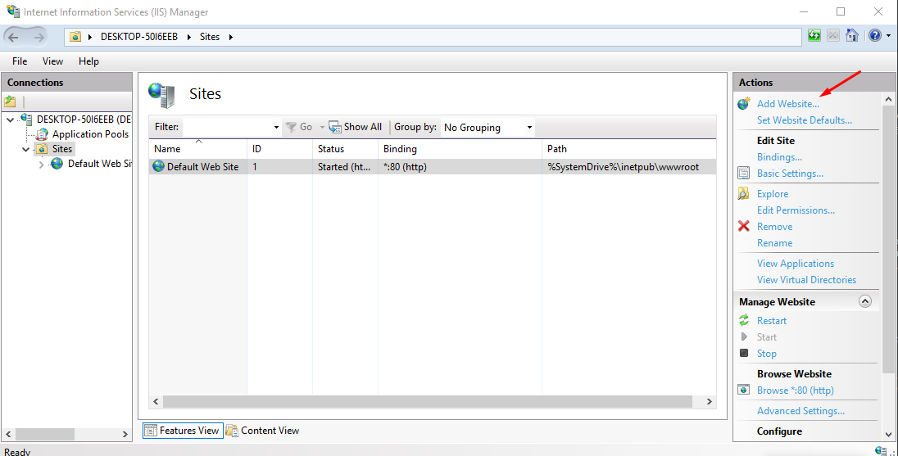
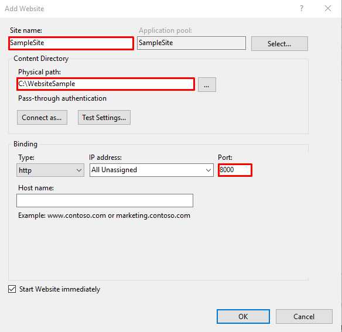
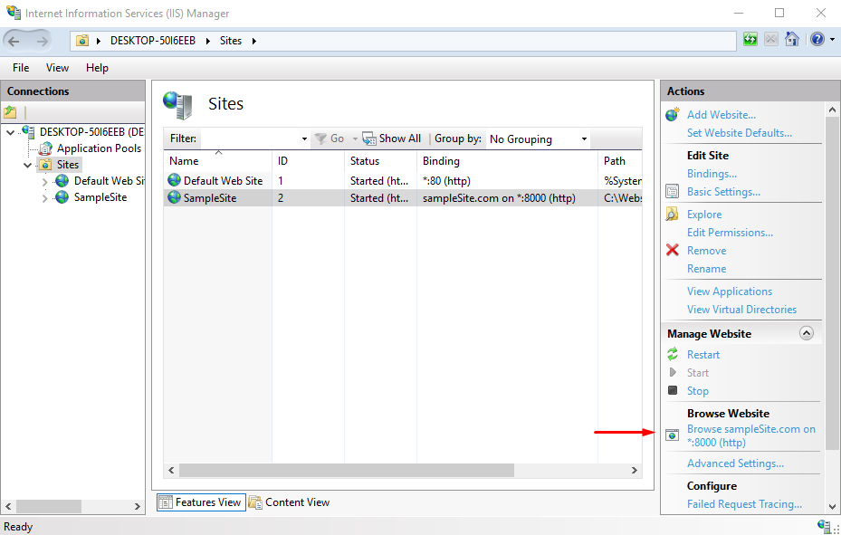

# IIS (Internet Information Service)

In this material you will learn how to host static websites and ASP.NET
applications with IIS manager.

## Environment

### IIS configuration (Windows only)

- Enable the IIS Management Console and World Wide Web Services.
  - Navigate to Control Panel > Programs > Programs and Features - Turn Windows
    features on or off (left side of the screen).
  - Open the Internet Information Services node. Open the Web Management Tools
    node. Check the box for IIS Management Console.
  - Check the box for World Wide Web Services.
  - Accept the default features for World Wide Web Services or customize the IIS
    features.

### Install the .NET Core Hosting Bundle

Go to this
[link](https://www.microsoft.com/net/permalink/dotnetcore-current-windows-runtime-bundle-installer)
and install .NET Core Hosting Bundle

## Materials & Resources

### Training

| Material                                                                      |      Time |
| :---------------------------------------------------------------------------- | --------: |
| [What is IIS](https://stackify.com/iis-web-server/)                           |         - |
| [Hosting an ASP.NET application](https://www.youtube.com/watch?v=ZZfRlBMHds8) | from 6:00 |

### Optional

| Material                                                                             | Time |
| :----------------------------------------------------------------------------------- | ---: |
| [Hosting with IIS](https://docs.microsoft.com/en-us/aspnet/core/host-and-deploy/iis) |    - |

## Material Review

- What is IIS?
- What is a site?
- What is an application pool?

## Workshop

### Step by step guide how to host a static HTML with IIS

- Create a folder somewhere on your C drive with an `index.html`.
- Fill it with a basic `<h1>Hello World</h1>`.
- Press the windows button on your keyboard and search for IIS.
- Open your IIS manager.
- Under `Connections` open the `Sites` tab, and under the `Actions` now you can
  add a new website.
  
- Set the site name and an unused port. Also add the physical path to the folder
  where you saved your HTML.
  
- After you saved your changes you are all set to host your static website.
  Return to your IIS Manager and click the link under the `Browse Website`.
  

### Exercise

Choose any ASP.NET application you have written so far and host it with IIS.
