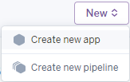
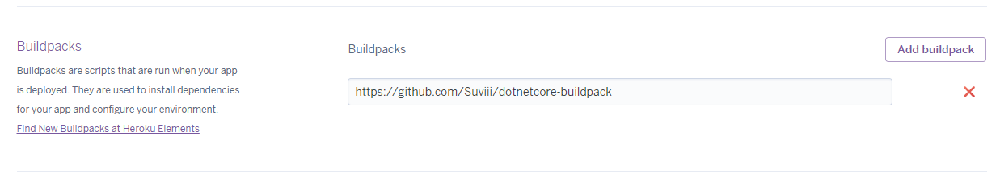
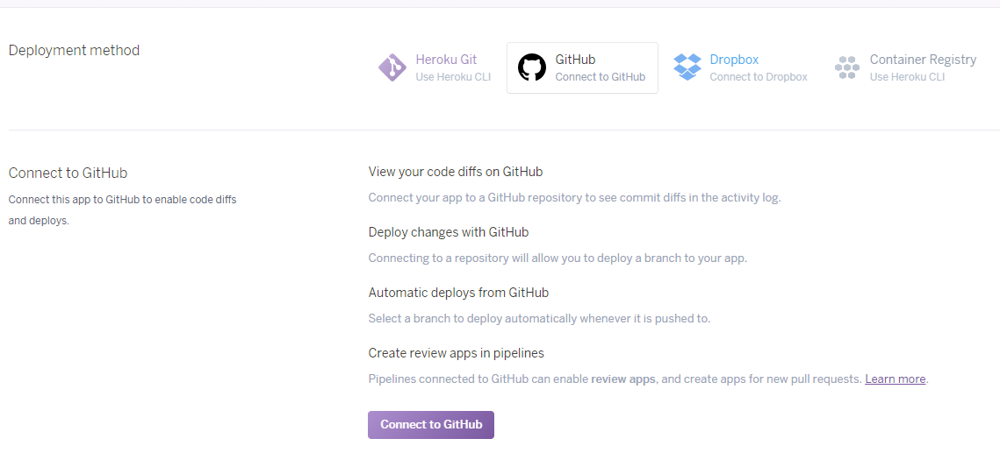
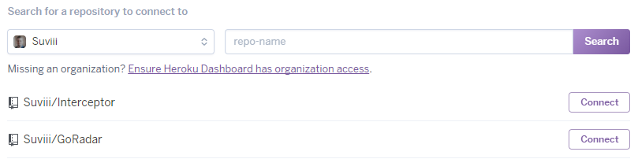
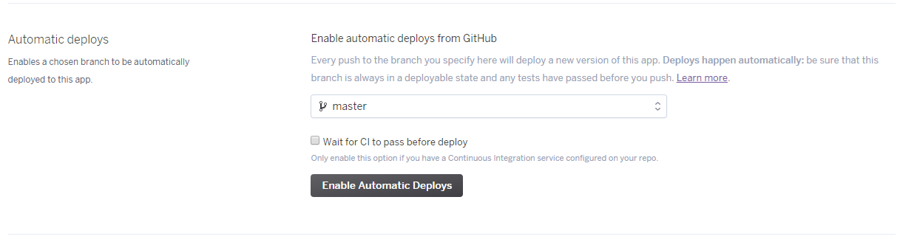

# Workshop

## First Online App

- Open GitHub
  - Create a new repository under your account
  - Push your `Bank of Simba` application to this new repository
- Open Heroku Dashboard
  - Create a new app
    
- Select the Setting tab of your freshly created app
  - Scroll down to buildpacks and add a custom a custom buildpack for:
    - .NET Core 1.1: `https://github.com/Suviii/dotnetcore-buildpack`
    - .NET Core 2.0: `https://github.com/Suviii/dotnetcore-buildpack#v2.0.3`
    
- Select the Deploy tab
  - Pick GitHub as deployment method and connect to GitHub
    
- After a successful authentication you can search your repositories
  - Connect to the `Bank of Simba` repository
    
- Now your app is live on Heroku
- You can enable automatic deploys
  - With that it will deploy your app after every change you make (in plain
    English: after you push to the repository)
    

## Exercise

- Create and host an online todo application

## Optional

- Make a user-password based login system for the todo application
