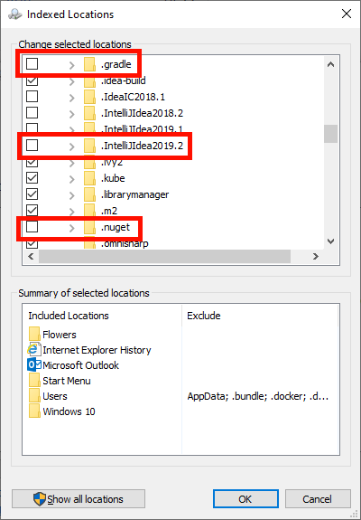
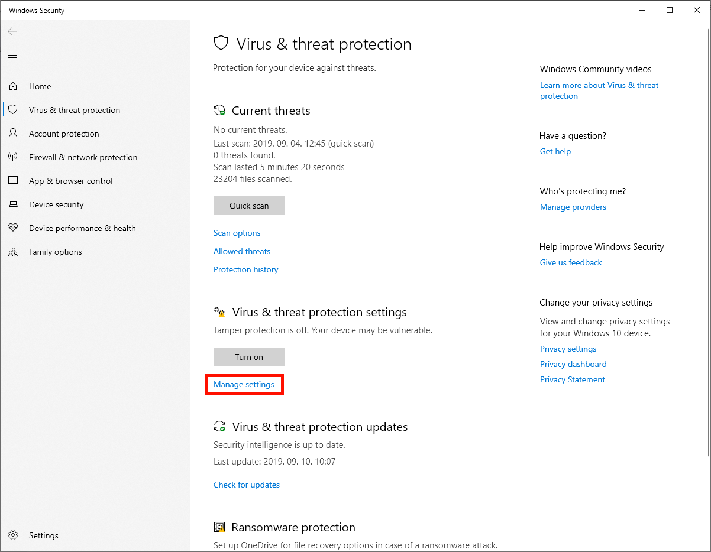
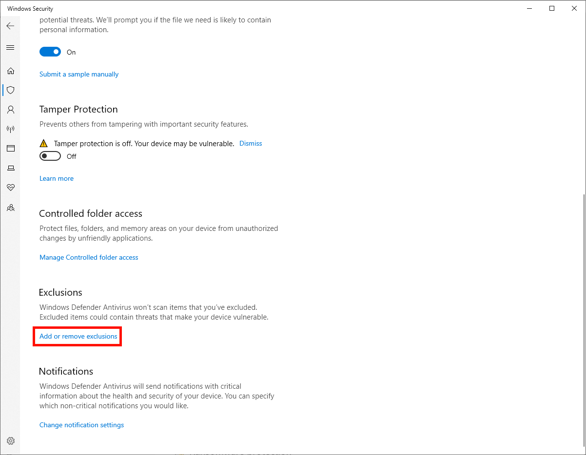
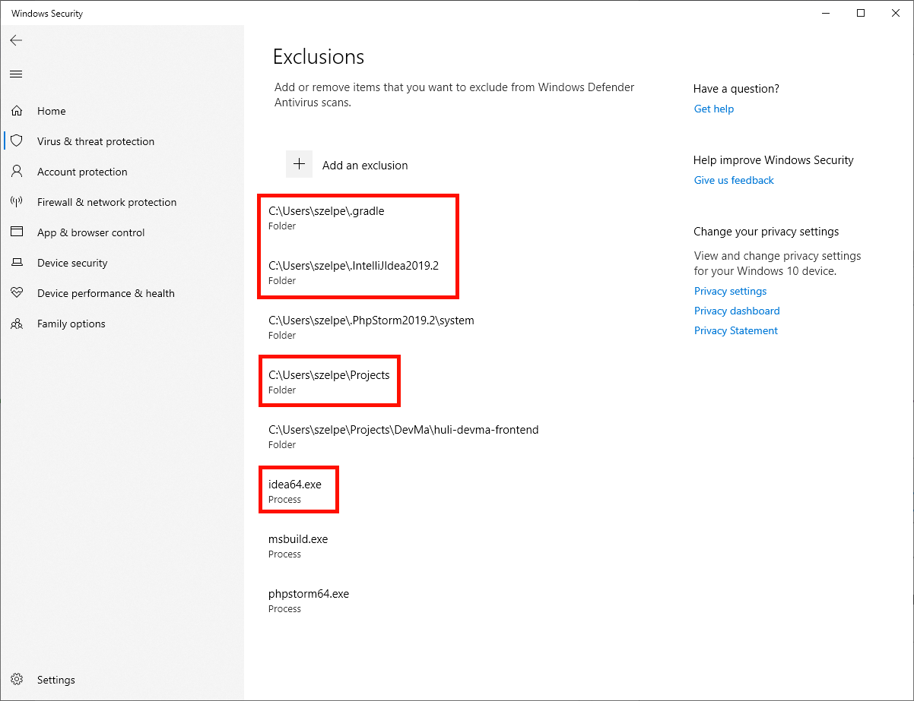

# How to speed up IntelliJ/CLion/WebStorm on Windows?

Things which slow down IntelliJ on Windows is the **Windows Indexing** service
the **Anti-Virus software**.

## Exclude project files from Windows Indexing

Open the "Indexing Options" window (press the windows button and start typing
"indexing"), and click on the "Modify" button. Find your user's home folder and
uncheck every folder which starts with `.IntelliJIdea` and `.gradle`.

Also, make sure to **uncheck the folder where your source code are**.

## Exclude project files form Windows Defender

Open up "Virus & threat protection settings" and click on "Add or remove
exclusions".

Add all the **folders** mentioned above as exclusions and also add the
**process** named `idea64.exe`.

## Other antivirus software

If you're using another antivirus software other than the built-in one in
Windows you must also set the exclusions in that software.

## Other software

You can use similar settings for CLion, WebStorm, Rider,PHPStorm, PyCharm and
all the IntelliJ derivatives to speed things up.

### References

- <https://intellij-support.jetbrains.com/hc/en-us/articles/360005028939-Slow-startup-on-Windows-splash-screen-appears-in-more-than-20-seconds>
- <https://rider-support.jetbrains.com/hc/en-us/articles/360006365380>
